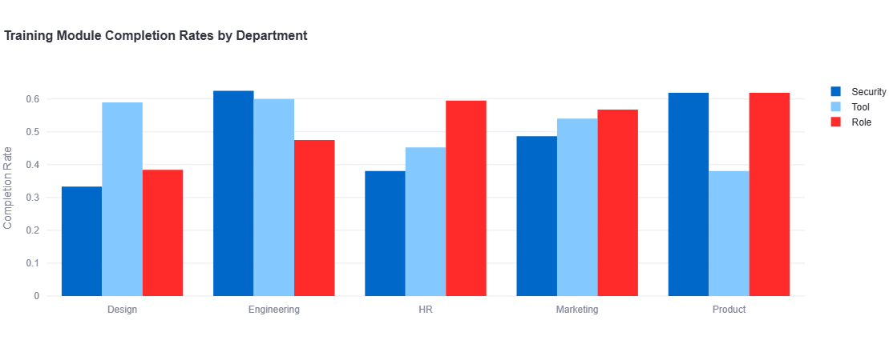

# Onboarding Training Compliance Tracker

This project is a Streamlit dashboard for analyzing onboarding training compliance, feedback, buddy assignment, and satisfaction.

## Overview

This project is a Streamlit-based interactive dashboard for analyzing onboarding training compliance, feedback, buddy assignment, and employee satisfaction. It uses Python, SQL (SQLite), and Plotly for data processing and visualization.

## Features

- **Filterable Dashboard:** Select departments and locations to view targeted insights.
- **Completion Rates by Department:** Interactive bar chart showing training module completion rates by department.
- **Manager Feedback vs. Modules Completed:** Interactive scatter plot visualizing feedback scores against modules completed.
- **Compliance vs. Satisfaction by Location:** Interactive heatmap showing compliance rates and satisfaction scores by location.
- **Buddy Assignment Impact:** Table showing average feedback and satisfaction scores for employees with and without buddies.
- **Module Completion by Department and Location:** Grouped bar chart showing completion rates for all modules by department and location.
- **Module Completion Trend by Start Date:** Line chart showing completion trends for all modules over time.

## How to Run

1. **Install dependencies:**
   ```bash
   pip install -r requirements.txt
   ```
2. **Start the dashboard:**
   ```bash
   streamlit run onboarding_dashboard.py
   ```
   or use the provided batch file:
   ```bash
   run_app.bat
   ```
3. **Alternative: Use the keep-alive script:**
   ```bash
   python keep_alive.py
   ```
4. **Interact with the dashboard:**
   - Use the sidebar to filter by department and location.
   - Explore all interactive charts and tables.
  
## Preventing Sleep Issues

To prevent the "Zzzz This app has gone to sleep due to inactivity" issue when deployed on Streamlit Community Cloud:

1. **Auto-refresh Implementation:**
   - The app includes a JavaScript-based auto-refresh mechanism that periodically sends requests to keep the connection alive
   - A visual indicator shows that auto-refresh is enabled

2. **Optimized Configuration:**
   - Config files are set up to optimize performance and prevent sleeping
   - Proper server settings are configured in `.streamlit/config.toml`

3. **For Streamlit Community Cloud Deployment:**
   - Make sure to set the app to "Always rerun" in the app settings
   - Add helpful badges and documentation to your GitHub repo

4. **Alternative Keep-Alive Method:**
   - A `keep_alive.py` script is included that can be run separately to periodically ping your app
   - Usage: `python keep_alive.py YOUR_APP_URL`

## Data

- The dashboard uses `onboarding_training_dataset.csv` as the source data.
- Data is cleaned and stored in a local SQLite database for analysis.

## File Structure

- `onboarding_dashboard.py`: Main Streamlit dashboard app.
- `onboarding_training_dataset.csv`: Onboarding data file.
- `onboarding_compliance.db`: SQLite database (auto-generated).
- `README.md`: Project documentation.
- `.streamlit/config.toml`: Streamlit configuration file.
- `keep_alive.py`: Optional script to prevent app sleeping when deployed.
- `DEPLOYMENT.md`: Additional deployment instructions.

## Live Demo(Training Compliance Dashboard)]
(https://harshith1118-smart-onborading-onboarding-dashboard-ctuavy.streamlit.app/)

## Screenshots
### Completion Rates by Department (Bar Chart)


### Manager Feedback vs. Modules Completed (Scatter Plot)


### Compliance vs. Satisfaction by Location (Heatmap)


### Buddy Assignment Impact (Table)


### Module Completion by Department and Location (Grouped Bar Chart)


### Module Completion Trend by Start Date (Line Chart)


## License

This project is for educational and internal use. Modify and extend as needed.
